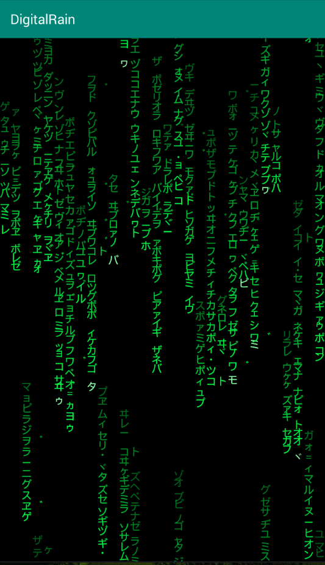

# DigitalRain
黑客帝国电影的字符下落效果的android自定义view实现。

代码参考了一个代码女神(@emilyxxie)的JS实现，视频在https://www.bilibili.com/video/av8810419/ 可以看到。 这个实现基于一个称为p5.js的项目，貌似这个js项目是专门用于在网页上实现特效用的。
非常感谢作者的实现思路，It's Awesome! Pretty cool!

运行的时候内存会一点一点的上涨，每次上升大约100kb左右，cpu消耗大约13%左右。尚未优化，这个自定义view的实现比作者的JS实现有些差距，然而和电影效果已经很接近了。感兴趣的朋友可以去看视频可以学习到更多的内容。

内存不断增加的问题解决，原因主要是将char类型字符通过调用String.value(char)方法转换为字符串造成的，查看String的源码发现每次调用value(char)方法都会调用new String()方法创建新的字符串，于是将字符串提前生成好放入一个String数组里面，问题解决。现在内存非常稳定，几乎不增加。

作者的git实现 https://github.com/emilyxxie/green_rain

